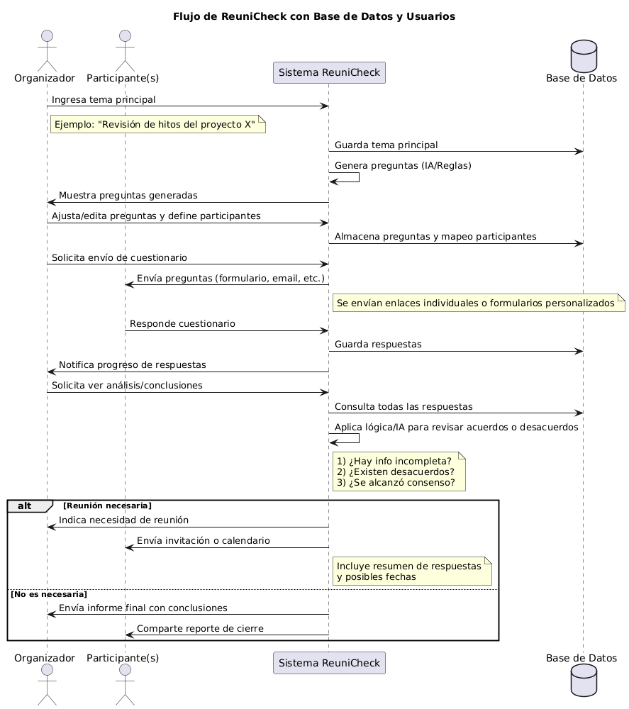

# **ReuniCheck**

## Descripción general
**ReuniCheck** es un sistema diseñado para determinar si una reunión es realmente necesaria y, en caso afirmativo, organizarla de la mejor manera posible. Si no se requiere una reunión, el sistema genera conclusiones o soluciones que evitan el gasto de tiempo de los participantes.

El producto consta de tres módulos principales, cada uno con responsabilidades específicas:

---

## Módulo 1: Generación de preguntas a partir del “tema principal”

1. **Entrada**  
   - El usuario (organizador) indica el tema principal de la reunión (ej. “Revisión de hitos del proyecto X”, “Discusión de estrategia de marketing”, etc.).

2. **Procesamiento / generación de preguntas**  
   - Con base en ese tema, el sistema (usando IA o reglas predefinidas) genera automáticamente un conjunto de preguntas relevantes.  
   - El objetivo es recopilar la información necesaria para:  
     - Tener claridad sobre el estado actual de la situación.  
     - Identificar posibles soluciones sin necesidad de una reunión presencial.  
     - Determinar si el tema está suficientemente abordado de manera asíncrona.

3. **Configuración opcional**  
   - Posibilidad de añadir o modificar manualmente las preguntas generadas por la IA, para ajustarlas a la realidad de la empresa o del equipo.  
   - Definir los participantes a quienes se les enviará cada pregunta (pueden existir preguntas específicas para ciertos roles).

**Salida/Resultado**  
- Lista final de preguntas enfocadas en el tema principal.  
- Mapeo de preguntas-participantes.

---

## Módulo 2: Distribución de preguntas y recopilación de respuestas

1. **Envío de cuestionario**  
   - El sistema envía las preguntas (vía formulario, email o plataforma de mensajería interna) a cada usuario/participante.  
   - Cada participante accede y responde en un entorno centralizado o recibe un enlace individual.

2. **Gestión de respuestas**  
   - El sistema almacena las respuestas en una base de datos, relacionándolas con cada participante y cada pregunta.  
   - Se registran los participantes que ya han respondido y los que no, con la posibilidad de enviar recordatorios automáticos.

3. **Interfaz de visualización (para el organizador)**  
   - Visualización del progreso de respuesta (quién contestó, quién falta).  
   - Acceso a las respuestas parciales, para ir evaluando de manera preliminar.

**Salida/Resultado**  
- Un conjunto completo de respuestas ordenadas por pregunta y participante.

---

## Módulo 3: Análisis y conclusiones (¿se necesita la reunión?)

1. **Procesamiento de respuestas**  
   - El sistema analiza toda la información recopilada. Esto puede hacerse con:  
     - Reglas lógicas (ej. si hay desacuerdos, si faltan datos clave, etc.).  
     - IA o procesamiento de lenguaje natural para identificar conflicto, consenso o vacíos de información.

2. **Toma de decisión**  
   - En base al análisis, el sistema determina:  
     - **Si la reunión es necesaria**: Existe información inconclusa, desacuerdos, bloqueos o puntos que requieren discusión colectiva.  
     - **Si la reunión NO es necesaria**: Se ha logrado consenso, el problema está resuelto o se pueden proponer soluciones concretas sin más debate.

3. **Acciones derivadas**  
   - **Caso A: reunión necesaria**  
     - El sistema alerta a los participantes (ej. vía correo o integración con el calendario) y propone una fecha y hora (opcional).  
     - Proporciona un resumen de las respuestas para preparar la reunión.  
   - **Caso B: reunión no necesaria**  
     - El sistema envía un informe final con las conclusiones y/o soluciones relevantes ya identificadas.  
     - Deja constancia en un histórico (acta virtual) de que el tema se resolvió sin convocar reunión.

4. **Entrega de conclusiones**  
   - Se genera un documento o reporte con el resultado del análisis, incluyendo:  
     - Puntos clave, soluciones propuestas.  
     - Razón por la que se concluye si la reunión es o no necesaria.

**Salida/Resultado**  
- Conclusión sobre la necesidad de reunión.  
- Convocatoria y agenda (si procede).  
- Solución o acto de cierre (si no se requiere reunión).

---

## Alcance completo
El alcance de **ReuniCheck** cubre todo el flujo, desde la generación de preguntas basadas en el tema (Módulo 1), hasta la distribución y recolección de respuestas (Módulo 2), para finalizar con el análisis automatizado y la decisión (Módulo 3) sobre la necesidad real de llevar a cabo la reunión.

De esta manera, el producto:
- Optimiza el tiempo de los equipos.
- Automatiza la creación de cuestionarios y la recolección de información.
- Provee una conclusión fundamentada que orienta la siguiente acción (reunión o solución inmediata).

Este ciclo permite a las empresas y equipos reducir reuniones innecesarias, mantener a todos informados y tomar decisiones más ágilmente.

---

## ¿Cómo empezar con ReuniCheck?

1. **Definir el tema**: Ingresa el tema principal que deseas abordar.  
2. **Generar preguntas**: Permite que el sistema cree una lista de preguntas relevantes (puedes editarlas).  
3. **Elegir participantes**: Selecciona quién debe responder cada pregunta.  
4. **Enviar cuestionarios**: Distribuye el formulario o los enlaces de respuesta.  
5. **Recopilar y analizar**: Observa en tiempo real el progreso de las respuestas y deja que el sistema aplique la lógica o IA para decidir.  
6. **Conoce el resultado**: Recibe una notificación indicando si se requiere reunión o no, junto con conclusiones y próximos pasos.

---

## Requisitos y Tecnologías (ejemplo)
- Lenguaje de programación backend: Python / Node.js / Java, etc.  
- Base de datos: MySQL / PostgreSQL / MongoDB, etc.  
- Servicios de mensajería o correo para notificaciones: SendGrid, SMTP, etc.  
- Opcional: Integración con APIs de calendario (Google Calendar, Outlook, etc.) para programar reuniones de forma automática.

## Flujo General de ReuniCheck

A continuación, se presenta un **diagrama de flujo** que ilustra cómo ReuniCheck interactúa con los distintos actores (Organizador y Participantes), la Base de Datos y el propio sistema en cada etapa:

1. **El Organizador** inicia el proceso definiendo el tema principal y ajustando preguntas.
2. **Los Participantes** reciben y responden dichas preguntas.
3. **ReuniCheck** reúne la información, la analiza y determina si realmente se necesita una reunión.
4. **La base de datos** centraliza todo (temas, preguntas y respuestas) para su posterior consulta y análisis.

Este esquema ofrece una **visión global** del proyecto, mostrando el recorrido de la información desde la generación de preguntas hasta la decisión final sobre la reunión o la emisión de un informe de conclusiones.

# Explicación paso a paso del diagrama

Este diagrama representa cómo **ReuniCheck** (el sistema) coordina las interacciones entre el **Organizador**, los **Participantes** y la **Base de Datos** para decidir si es necesaria una reunión o se pueden extraer conclusiones sin convocarla.

1. **Ingreso del tema principal**  
   - El _Organizador_ inicia el proceso indicando el tema que motiva la posible reunión (por ejemplo: "Revisión de hitos del proyecto X").  
   - Esto se guarda en la Base de Datos para referencia posterior.

2. **Generación de preguntas (IA/Reglas)**  
   - El **Sistema ReuniCheck** genera automáticamente un conjunto de preguntas relevantes (usando inteligencia artificial o reglas predefinidas).  
   - Se muestran al Organizador para que las revise o ajuste según sus necesidades.

3. **Ajuste y definición de participantes**  
   - El _Organizador_ puede editar, añadir o quitar preguntas según la realidad de su equipo.  
   - También asigna quién debe responder a cada pregunta (por ejemplo, solo el líder técnico o todo el departamento).

4. **Solicitud de envío de cuestionario**  
   - Una vez definidas las preguntas y participantes, el Organizador solicita al sistema que envíe los cuestionarios.  
   - El **Sistema ReuniCheck** almacena todos esos ajustes (preguntas y participantes) en la Base de Datos.

5. **Envío de cuestionario a Participantes**  
   - El **Sistema ReuniCheck** envía las preguntas a los destinatarios indicados, ya sea por correo, mensajería interna o enlaces personalizados.  
   - Cada **Participante** recibe su formulario (o enlace) y procede a contestarlo en un entorno centralizado.

6. **Respuestas de los Participantes**  
   - Los **Participantes** responden las preguntas y el sistema va guardando esas respuestas en la Base de Datos.  
   - El **Sistema ReuniCheck** puede notificar al Organizador sobre quién ya ha contestado y quién falta por responder.

7. **Solicitud de análisis/conclusiones**  
   - El _Organizador_ solicita al sistema que analice la información recopilada.  
   - El **Sistema ReuniCheck** consulta todas las respuestas en la Base de Datos.

8. **Aplicación de lógica/IA**  
   - El sistema revisa los datos para detectar:  
     1. Si falta información clave.  
     2. Si existen desacuerdos entre los participantes.  
     3. Si se ha alcanzado un consenso claro.  
   - En base a este análisis, el sistema toma la decisión final sobre la necesidad de reunión.

9. **Decisión: ¿Reunión necesaria?**  
   - **Caso A (Reunión necesaria):**  
     - El sistema indica que hace falta reunión y genera una invitación o un enlace de calendario con las posibles fechas.  
     - Se adjunta un resumen de respuestas y puntos a tratar en la reunión.  
   - **Caso B (No es necesaria la reunión):**  
     - Se elabora un informe final con las conclusiones y soluciones propuestas.  
     - Se comparte con los participantes y queda registrado que el tema se resolvió sin convocar una reunión.

10. **Informe/Convocatoria**  
   - Si hay reunión, el sistema crea el acto en el calendario y envía avisos a los involucrados.  
   - Si no la hay, se distribuye un reporte de cierre.  
   - Con ello, el proceso concluye.

Este diagrama refleja cómo **ReuniCheck** optimiza el tiempo de los equipos mediante:
- La generación automatizada de preguntas.
- La recolección eficiente de respuestas.
- Un análisis fundamentado que decide si el intercambio asíncrono es suficiente o si, efectivamente, hace falta convocar una reunión.

